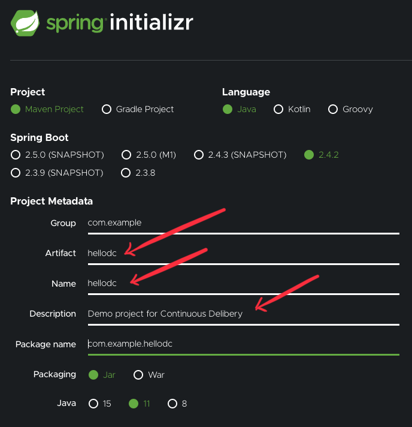
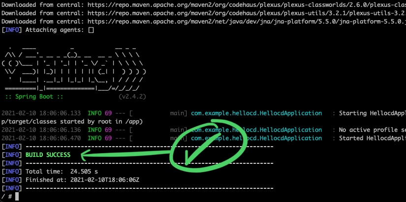
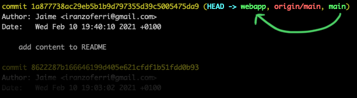
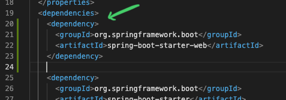
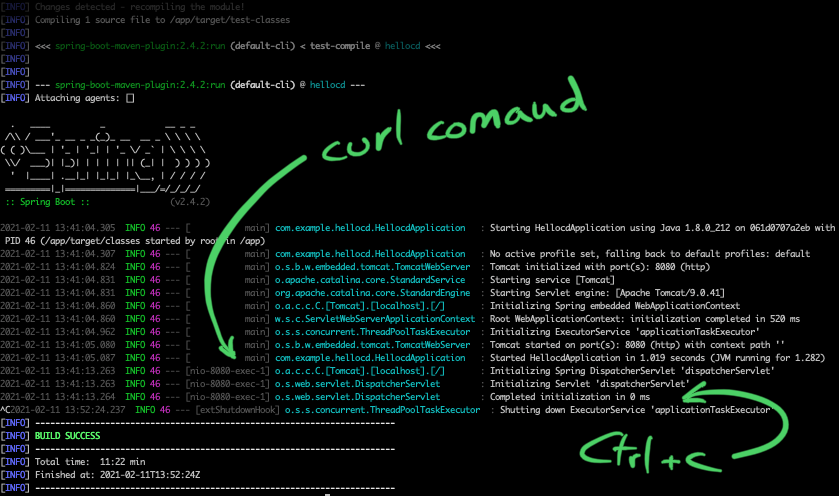
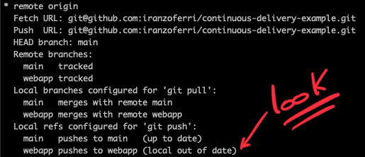
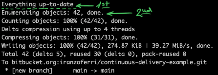

# CONTINUOUS DELIBERY (CD) ♾️
### Maven example "hello world"
Using:
- Spring (2.4.2)
- Github
- Docker
- Maven

This is a tutorial is based on the knowledge acquired in the course [LFS261](https://training.linuxfoundation.org/training/devops-and-sre-fundamentals-implementing-continuous-delivery-lfs261/)

Lets started. Go to [start.spring.io](https://start.spring.io/) for create a example "hello world" app



When done click "Generate" button, this will download the project, extract it into a folder.


Go into the directory of extracted project and see the contents:
```bash
ls -a
# .DS_Store
# .git
# .gitignore
# .mvn
# HELP.md
# mvnw
# mvnw.cmd
# pom.xml
# src
```

Init the repository and upload it to github (generate it first on github):
```bash
git init
git add .
git commit -m "add files generated with start.spring.io, maven example project"
git remote add origin git@github.com:iranzoferri/continuous-delivery-example.git
```

Ok, now we go to build the application using docker, manually.

```bash
absolute_path=/home/... # <-- Put here the project path

# Create a volume for persistence:
docker volume create m2

# Run maven container:
docker container run --rm -it -v ${absolute_path}/continuous-delivery-example:/app maven:alpine sh
```

This provide us a running container with an interactive shell for typing next command:

```bash
mvn spring-boot:run -f app/pom.xml
```

This is the result (You will see a lot of lines)


Inside the container:
```bash
ls /root/.m2/
# repository
# copy_reference_file.log
# settings-docker.xml
```

Then, now we can simplify the build process with docker with persistence, using this command:

```bash
docker container run --rm -it -v m2:/root/.m2 -v /home/jaime/repos/github/continuous-delivery-example:/app maven:alpine mvn spring-boot:run -f app/pom.xml
```

## CREATE A GIT BRANCH

Now, we create a branch (and switch to it with -b <new_branch>) named "webapp"

```bash
git checkout -b webapp
```



Now, you can begin to code a "Hello world" example or simply catch it from this repository of the recomended [LFS261 course](https://training.linuxfoundation.org/training/devops-and-sre-fundamentals-implementing-continuous-delivery-lfs261/), or follow the instructions placed in the [spring-guides](https://github.com/spring-guides/gs-spring-boot) repository, .

Maybe you desire implement a more complex project, you can find some interesting tutorials like "api REST" or "OAuth2"... in this web site [howtodoinjava.com](https://howtodoinjava.com/spring-boot2/rest/rest-api-example/)

You decide, but in the course [LFS261](https://training.linuxfoundation.org/training/devops-and-sre-fundamentals-implementing-continuous-delivery-lfs261/) of "The Linux Foundation" given by "Gourav Shah" you will be able to learn in detail the whole process of implementation of Continuous Deployment, I recommend it. I'm going to continue with the [LFS261](https://training.linuxfoundation.org/training/devops-and-sre-fundamentals-implementing-continuous-delivery-lfs261/) example tutorial.

Now, copy te contents of this two files:
- [HellocdApplication.java.v2](https://raw.githubusercontent.com/lfs261/devops-repo/master/hellocd/HellocdApplication.java.v2) <-- Replace
- [pom.xml](https://raw.githubusercontent.com/lfs261/devops-repo/master/hellocd/pom.xml.snippet1) <-- Insert (see photo)



Upload the changes:
```bash
git push --set-upstream origin webapp
```
```
Enumerating objects: 25, done.
Counting objects: 100% (25/25), done.
Delta compression using up to 8 threads
Compressing objects: 100% (11/11), done.
Writing objects: 100% (14/14), 63.19 KiB | 10.53 MiB/s, done.
Total 14 (delta 3), reused 0 (delta 0)
remote: Resolving deltas: 100% (3/3), completed with 3 local objects.
remote:
remote: Create a pull request for 'webapp' on GitHub by visiting:
remote:      https://github.com/iranzoferri/continuous-delivery-example/pull/new/webapp
remote:
To github.com:iranzoferri/continuous-delivery-example.git
 * [new branch]      webapp -> webapp
Branch 'webapp' set up to track remote branch 'webapp' from 'origin'.
```

### WORK ON OTHER STATION (HOME/OFFICE)

At this moment, we will work on other PC, its time to pull all the work has we make in to this machine.

```bash
# We suppose that this command already executed before:
git clone git@github.com:iranzoferri/continuous-delivery-example.git

# Then, we need to pull the changes from aother branch, "webapp", isn't in this machine...
# Do that:
git branch -b # To inspect available remote branches
git checkout -t remotes/origin/webapp # To set up to track remote branch
git pull --all # To fetching origin, now set to "webapp"
```

This is where I am actually running Docker. But, the idea is to do on your machine, however, if you need to change usually, home/office, these commands will help you.

Now, go with previous command, but assigning a name to easy identify and map port to access it:
```bash
docker container run --name maven_alpine --rm -it -p 8081:8080 -v m2:/root/.m2 -v /home/jaime/repos/github/continuous-delivery-example:/app maven:alpine mvn spring-boot:run -f app/pom.xml
```

And go inside the container:
```bash
docker exec -it maven_alpine /bin/bash
# bash-4.4# 
curl http://localhost:8080
# {"timestamp":"2021-02-11T13:10:56.933+00:00","status":404,"error":"Not Found","message":"","path":"/"}
```

This is because annotations are missing, but don't worry, "v2" has already been fixed and what you will see is this:

```bash
# From your system:
 ~$ curl http://localhost:8081
Hello World!
# or inside the container:
docker exec -it maven_alpine /bin/bash
curl http://localhost:8080
```

Pay attention to the port change 8081 --> 8080, outside/inside.



Now, you be able to Continuous Delivery. It's great!


Merge all the changes into the main branch.
```bash
git merge webapp
git branch -D webapp # <-- delete unused branch
```


### WORK WITH MULTIPLE REPOS

In some projects we need to share your work with the team, or with other team of other company...
Well, look how to solve this problem.

Inspect your situation:
```bash
git remote show origin 
```



You need "up to date" in your working branch, pull or push to synchronize all places.

In this case:
```bash
git pull
```

Now, in steps:

1. Define a remote with multiple urls (with first repo url):
```bash
git remote add all git@github.com:iranzoferri/continuous-delivery-example.git
```

2. Set first push url (with first repo url):
```bash
git remote set-url --add --push all git@github.com:iranzoferri/continuous-delivery-example.git
```

3. Set second push url (with second repo url):
```bash
git remote set-url --add --push all git@bitbucket.org:iranzoferri/continuous-delivery-example.git
```

4. Push "main" branch (in this case, but you can select which you want) to "all" (Remember here "all" is a remote):
```bash
git push all main
```

See the result:

