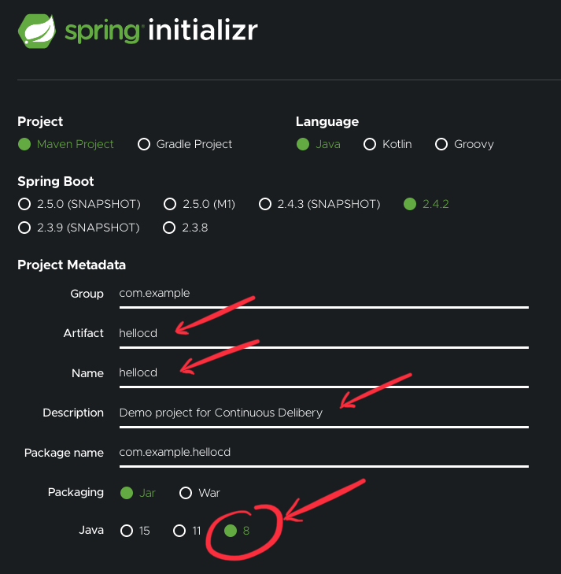

# CONTINUOUS DELIBERY (CD) ♾️
### Maven example "hello world"
Using:
- Spring (2.4.2)
- Github
- Docker
- Maven

Learned in the course [LFS261](https://training.linuxfoundation.org/training/devops-and-sre-fundamentals-implementing-continuous-delivery-lfs261/)

Lets started. Go to [start.spring.io](https://start.spring.io/) for create a example "hello world" app



When done click "Generate" button, this will download the project, extract it into a folder.


Go into the directory of extracted project and see the contents:
```bash
ls -a
# .DS_Store
# .git
# .gitignore
# .mvn
# HELP.md
# mvnw
# mvnw.cmd
# pom.xml
# src
```

Init the repository and upload it to github (generate it first on github):
```bash
git init
git add .
git commit -m "add files generated with start.spring.io, maven example project"
git remote add origin git@github.com:iranzoferri/continuous-delivery-example.git
```

Ok, now we go to build the application using docker, manually.

```bash
absolute_path=/home/... # <-- Put here the project path

# Create a volume for persistence:
docker volume create m2

# Run maven container:
docker container run --rm -it -v ${absolute_path}/continuous-delivery-example:/app maven:alpine sh
```

This provide us a running container with an interactive shell for typing next command:

```bash
mvn spring-boot:run -f app/pom.xml
```

This is the result (You will see a lot of lines)


Inside the container:
```bash
ls /root/.m2/
# repository
# copy_reference_file.log
# settings-docker.xml
```

Then, now we can simplify the build process with docker with persistence, using this command:

```bash
docker container run --rm -it -v m2:/root/.m2 -v /home/jaime/repos/github/continuous-delivery-example:/app maven:alpine mvn spring-boot:run -f app/pom.xml
```

## CREATE A GIT BRANCH

Now, we create a branch (and switch to it with -b <new_branch>) named "webapp"

```bash
git checkout -b webapp
```


Now, you can begin to code a "Hello world" example or simply catch it from this repository of the recomended [LFS261 course](https://training.linuxfoundation.org/training/devops-and-sre-fundamentals-implementing-continuous-delivery-lfs261/), or follow the instructions placed in the [spring-guides](https://github.com/spring-guides/gs-spring-boot) repository, .

Maybe you desire implement a more complex project, you can find some interesting tutorials like "api REST" or "OAuth2"... in this web site [howtodoinjava.com](https://howtodoinjava.com/spring-boot2/rest/rest-api-example/)

You decide, but in the course [LFS261](https://training.linuxfoundation.org/training/devops-and-sre-fundamentals-implementing-continuous-delivery-lfs261/) of "The Linux Foundation" given by "Gourav Shah" you will be able to learn in detail the whole process of implementation of Continuous Deployment, I recommend it. I'm going to continue with the [LFS261](https://training.linuxfoundation.org/training/devops-and-sre-fundamentals-implementing-continuous-delivery-lfs261/) example tutorial.

Now, copy te contents of this two files:
- [HellocdApplication.java.v1](https://raw.githubusercontent.com/lfs261/devops-repo/master/hellocd/HellocdApplication.java.v1) <-- Replace
- [pom.xml](https://raw.githubusercontent.com/lfs261/devops-repo/master/hellocd/pom.xml.snippet1) <-- Insert (see photo)


